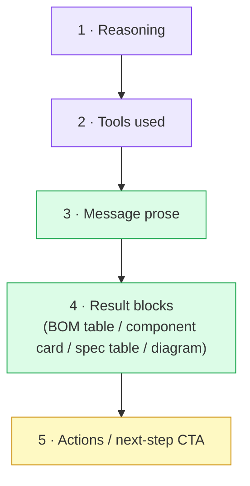
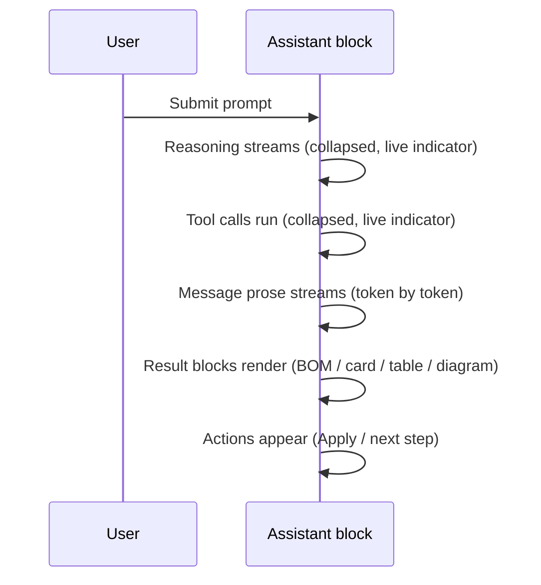

# Assistant chat UI — layout spec

> Defines the canonical block order, default states, streaming sequence, loading UI, message
> and card types, and docked-panel geometry for every assistant reply.
>
> The base of this document is the chat response layout spec. Absorbed into it is the durable
> message-type and docked-panel material from a design review transcript. That transcript's
> mockup images no longer exist, so everything taken from it is described in words.
>
> Two conflicts between the two sources are resolved in §2.1 and §5.1. Neither source is
> carried on both sides.

---

## 1. Goal

Every assistant reply must read top-to-bottom as **think → act → answer**.

- **Reasoning** — how it thought
- **Tools** — what it did
- **Answer** — the result: prose first, then result cards and tables
- **Actions** — the next step, e.g. applying proposed commands

---

## 2. Canonical block order



**Hard rule:** result blocks live **inside the answer, at the end**. No result card ever floats
**above** the tool trace or the message prose.

### 2.1 Conflict resolved — cards are blocks, not peer messages

The design transcript modelled the transcript as a five-level message taxonomy in which tool
calls and proposals are **peer message types** in the stream, alongside user and assistant
messages. That is not the model used here.

**Resolution: the block-order model wins.** It is the tighter contract — it fixes the position
of every element relative to the answer, whereas a peer-message model leaves ordering to
whatever sequence the backend happened to emit, which is precisely the defect the block-order
spec was written to fix.

The transcript's card types are all preserved, but as **blocks within an assistant turn**, not
as siblings of it:

| Transcript "message type" | Where it lives here |
|---|---|
| User message | A real peer message. See §6.1. |
| Assistant message | A real peer message; it is the container for blocks 1–5. |
| Tool call | Block 2 of the containing assistant turn. Never free-floating. |
| Proposal (BOM, placement, ERC/DRC fix) | Block 4 result + block 5 actions of the containing turn. |
| System notice | The one genuine peer type besides user and assistant. See §6.3. |

The practical consequence: a proposal card is never rendered before the prose that explains it,
and a tool trace is never rendered in the middle of an answer.

---

## 3. Default states

| # | Block | Default state | Collapsed summary line |
|---|---|---|---|
| 1 | Reasoning | **Collapsed** | `Reasoning` |
| 2 | Tools used | **Collapsed** | `Resolve BOM · 6 src · 17ms` — tool name, sources, latency |
| 3 | Message prose | Always visible | — |
| 4 | Result blocks | Always visible | — |
| 5 | Actions | Always visible | — |

- Collapsed blocks show a one-line summary, so the trust trail is visible without expanding.
- If no tools ran, **omit the Tools block entirely** — no empty shell.
- If there is no reasoning, omit the Reasoning block.

---

## 4. Streaming sequence

Temporal order **equals** visual order. Nothing reorders after the fact.



1. **Prose streams first**, token by token.
2. **Result blocks render last**, after prose completes — never before.
3. Each phase shows **one** active loading indicator, at the current position (§5).
4. Reasoning and Tools stay **collapsed** during and after streaming.

---

## 5. Loading indicator

**One indicator. Inline. No border. No duplicate dots.**

| Rule | Value |
|---|---|
| Count | Exactly one active indicator at a time |
| Style | Plain inline text plus spinner — **no bordered box** |
| Position | At the active block: header status, then body caret as prose streams |
| Stop control | Inline `Stop` link or button next to the status text |
| Bouncing `• • •` dots | **Removed** |

Target rendering during the prose phase:

```
(spinner) Writing response…   [Stop]
|(prose streams here)
```

Phase labels:

| Phase | Status text |
|---|---|
| Reasoning | `Thinking…` |
| Tool call | `Running tools…`, or the tool name, e.g. `Resolving BOM…` |
| Prose | `Writing response…` |

### 5.1 Conflict resolved — the bouncing dots are removed

A QA pass recorded the streaming state as correct with a `Writing response…` spinner, a `Stop`
control **and** pulsing dots, and marked it as passing.

**Resolution: this spec wins — the dots are removed.** They duplicate information already
carried by the status line, and a passing QA check on a duplicated indicator only records that
both elements rendered, not that both should exist. **The QA pass predates this spec**; it did
not evaluate the rule it appears to contradict.

---

## 6. Message types in the transcript

Only three things are peer entries in the stream.

### 6.1 User message

Visually distinct from assistant output at a glance, so a long thread can be scanned for "what
I asked" without reading. The transcript's recommendation — a right-aligned tinted bubble with
a tail — satisfies this; any treatment that makes the distinction pre-attentive does.

The audit finding this addresses: user and assistant messages were both left-aligned and
differed only by icon colour.

### 6.2 Assistant message

The container for blocks 1–5 of §2. It carries an attribution line with run metadata —
assistant identity, tool-call count, elapsed time.

### 6.3 System notice

A distinctly styled banner with an icon and an action, not italic prose. The failure mode this
fixes is a provider-failure notice rendering identically to assistant content, so the user
cannot tell the difference between something the model said and something the app said.

A system notice **stays in the thread** after the situation resolves. It is history: a user
asking "why did this answer come out this way" needs to see the recovery. It may carry a
dismiss control.

### 6.4 Run-state affordances — the asymmetry rule

**Cancelled and failed runs show a Retry affordance. A completed-but-empty run must behave the
same way.**

This is a UX invariant, not a bug report. A run that completes with no content, no tool events
and no run state currently renders as a bare empty bubble with no explanation and no way
forward, while a strictly less-recoverable outcome — an outright failure — gets a Retry button.
The empty-completed case must reuse the same retry path.

---

## 7. Result blocks

- Reuse the existing card and table designs. Their visuals are approved; only **position**
  changes.
- They render inline at the end of the answer, under the prose.
- A result block — BOM, component pick, spec, placement, diagram — is an **AI proposal**. Its
  primary action ties to the command pattern, at `Propose` level by default.

| Result type | Primary action |
|---|---|
| BOM proposal | `Apply BOM` / `Place components` — dispatches commands, never raw JSON |
| Single component | `Add to schematic` |
| Placement proposal (schematic) | `Add to schematic` (see §9) |
| Spec / explanation | None — informational |
| Diagram | None — informational; card controls only (§11) |

The assistant defaults to **Propose** and applies commands only on an explicit user click. The
CTA *is* that click — not grey prose telling the user what they could do next.

### 7.1 Card content rules

Derived from the transcript's defect list; each is a rule about what a result card must not
leak.

| Rule | Defect it prevents |
|---|---|
| Never show internal tool names to the user | `designer_get_design_summary` rendered verbatim in the trace. See §10. |
| Never show raw truncated JSON as tool parameters | Parameters truncated mid-key, reading as a stack trace. Render a key/value grid with formatted values; fall back to raw JSON only for unknown shapes. |
| Never show a unitless internal score | `score 2.20` means nothing to a user. Normalise to a 0–100% relevance indicator. |
| Never repeat a constant badge on every row | `BUILT-IN` on all eight results is noise; move constant facets to the result-set header. |
| Cap visible tags | Two tags per card; the rest belong in the expanded detail. |
| One result block per part | A part shown as both a card and a table row is a duplicate, not emphasis. |
| No internal markers or query traces in proposal rows | `[passive] [builtin] [system] [generic-resolved]`, `query: LED → led`, and verbose resolver disclaimers are debugging output. |
| Flat structure | A component card inside a list item inside a proposal card is three levels of nesting carrying one level of information. Use a flat table. |
| Status is one value | `1 component(s) ready · applied` is self-contradictory. Show a single status pill: `PENDING`, `READY`, or `APPLIED`. |

---

## 8. Proposal action hierarchy

The failure being corrected: an irreversible action, a destructive action, a navigation action
and a session-wide preference were all rendered as four equal-weight buttons in one row.

| Action class | Weight | Placement | Example |
|---|---|---|---|
| Primary action | Filled accent button | Bottom-right of card | `Apply placement`, `Add to schematic` |
| Reject | Plain text link | Bottom-right, before the primary | `Reject` |
| Navigation | Outlined button in the card header | Top-right of header | `Preview in Designer` |
| Meta-preference | Inline checkbox in a subtle bottom strip | Below the action row | `Don't ask again this session` |
| Safety net | Timeout text | Right side of the meta strip | `Will auto-reject in 5 min` |

The hierarchy scales to every confirmation surface: BOM proposals, placement proposals, ERC
fixes, DRC fixes, schematic generation.

**Unverified:** the auto-timeout is a proposal, not a shipped behaviour, and its duration was
never settled. Ship the hierarchy without it if the session-timer work is not in scope; the
strip reads correctly with only the checkbox.

---

## 9. Placement proposals — schematic placement is logical, not physical

A schematic placement proposal **must not show coordinates and must not show a board preview.**

This is a domain rule, not a layout preference. Placing a symbol into a schematic means "add
this part to the design". It does not mean "position it at (x, y)". Presenting millimetre
coordinates on a schematic placement teaches the user a false model of what the operation does,
and invites them to review numbers that carry no design intent.

What a schematic placement proposal shows instead:

| Element | Content |
|---|---|
| Subtitle | The target schematic, by name, and the part count |
| Body | A single list grouped by component family, one row per part |
| Per-row visual | A schematic-symbol thumbnail — resistor rectangle, capacitor plates, LED triangle, transistor |
| Primary action | `Add to schematic` — the verb matches the operation |
| Footer note | That symbols are placed without wires, and that the user rearranges and then wires |

Coordinates and a board preview belong to a **PCB** placement proposal, where position is the
actual content of the proposal. That surface does not exist yet; when it does, it uses the
coordinate formatter in §10.

---

## 10. Formatters and name maps

### 10.1 Coordinate display — nanometres never reach the user

World coordinates are nanometres. That is correct for the data model and wrong for every
display surface.

```ts
formatBoardCoord(nm: number): string {
  const mm = nm / 1_000_000;
  if (Math.abs(mm) < 0.01) return "0.00";   // suppress -0.00
  return mm.toFixed(2);
}

formatBoardPoint(p: { x: number; y: number }): string {
  return `${formatBoardCoord(p.x)} · ${formatBoardCoord(p.y)} mm`;
}
```

The `-0.00` suppression is the reason this is a shared helper rather than an inline division:
a signed zero rendered as `-0.00` reads as a defect, and it appears whenever a coordinate is a
small negative epsilon.

Apply everywhere a coordinate is shown: PCB placement proposals, the PCB inspector position
fields, the status-bar cursor readout, and schematic positions. A future mil preference uses the
same formatter with a `÷ 25_400` divisor and a `mil` suffix.

**Unverified:** there is no evidence this formatter shipped.

### 10.2 Tool display names

Internal tool names are hostile in the UI. A static map converts them, with a fallback that
humanises unmapped snake_case names by replacing underscores with spaces and capitalising.

| Internal name | Display | Icon |
|---|---|---|
| `designer_get_design_summary` | Read design | `file-search` |
| `designer_create_design` | Create design | `square-plus` |
| `designer_place_components` | Place components | `layout-grid` |
| `designer_wire_pins` | Wire pins | `route-2` |
| `designer_add_net` | Add net | `vector` |
| `library_search_components` | Search library | `search` |
| `library_resolve_bom` | Resolve BOM | `list-check` |
| `library_get_component` | Get component | `package` |
| `bom_set_mpn` | Set MPN | `barcode` |
| `bom_auto_source` | Auto-source BOM | `sparkles` |
| `pcb_run_drc` | Run DRC | `shield-check` |
| `schem_run_erc` | Run ERC | `shield-check` |

The map is UI-layer data and must not become a second source of truth for which tools exist —
an unmapped name renders through the fallback rather than failing.

**Unverified:** there is no evidence this map shipped. The tool list above reflects the names
used in the source review and should be reconciled against the registry before use.

---

## 11. Diagram cards

Diagrams are deliverables, not paragraphs. A diagram emitted in an answer is wrapped in a card
frame rather than rendered bare inside the markdown body.

Card chrome, identical for every diagram so the affordance is learned once:

| Element | Content |
|---|---|
| Type pill | `FLOWCHART`, `STATE`, `SEQUENCE`, `MINDMAP`, `PIE` — derived from the diagram source's own header keyword |
| Title | The diagram's title |
| Control — source | Reveals the raw diagram source for copy, edit, debug |
| Control — download | Exports the rendered SVG |
| Control — fullscreen | Opens an overlay for complex diagrams |
| Body | The render, on a subtly distinct background so it separates from chat |

### 11.1 Diagram types and when to emit them

| Type | Emit when | Electronics example |
|---|---|---|
| Flowchart | Decision logic, design process, signal flow | Power-supply topology selection: buck / boost / LDO / isolated |
| State diagram | Firmware state machines, button handling, power modes | Button debouncer: idle → debouncing → pressed → released |
| Sequence diagram | Protocols and handshakes with two or more parties | An I²C sensor read |
| Mindmap | Requirements analysis, open-ended design considerations | Design axes for an IoT sensor node |
| Pie chart | Part-of-whole breakdowns | BOM cost by category, power budget, area utilisation |

Heuristic for the agent: **choose the diagram type before writing the content.** Identifying
"this is a state machine" and emitting a state diagram produces a useful artifact; writing
prose and then bolting a generic flowchart onto it does not.

Gantt and ER diagrams are recognised types but are out of scope for design work.

---

## 12. Docked panel

The assistant also renders as a panel docked beside the designer canvas. Everything above
applies unchanged; this section adds the geometry that is specific to the docked surface.

### 12.1 Resize handle

| Property | Value |
|---|---|
| Width | 4 px |
| Cursor | `col-resize` |
| Minimum width | 280 px |
| Maximum width | 600 px |
| Default width | 380 px |
| Double-click | Snaps to default |
| Persistence | Width is stored **per design** |

Idle state is a subtle dark strip; hover reveals a thin accent indicator. The bounds are a
single global range, not a per-monitor setting.

### 12.2 Narrow-width reflow

Below a **480 px** panel width, result cards switch from the two-column grid used in the
standalone view to a single-column dense row layout:

| Aspect | Standalone | Docked, narrow |
|---|---|---|
| Columns | 2 | 1 |
| Symbol thumbnail | 42 × 34 px | 30 × 24 px |
| Tags | 2 chips | None — moved to expanded detail |
| Relevance | Bar plus percentage | Same, inline right of the row |
| Best-match treatment | Badge plus drag hint | A micro-pill only |
| `Open in Library` button | Explicit button | Removed — the whole row is the target |

Same data, roughly 55% less vertical space per card.

### 12.3 Identity

The chat is one entity rendered on two surfaces. The chat name string is identical in the
docked panel and the standalone view; the docked panel does not invent a shortened or
decorated variant.

The header-chrome reduction for this panel is a backlog item, not part of this contract — see
`docs/design/ui-backlog.md`.

---

## 13. Anti-patterns

| Do not | Do instead |
|---|---|
| Float a result card **above** the tools or prose | Put the result block at the **end** of the answer |
| Put the Tools block in the middle of the content | Tools is block 2, directly under Reasoning |
| Let intro prose appear last | Intro prose comes before result blocks |
| Draw a bordered box around `Writing response…` | Inline status text, no border |
| Show `Writing response…` **and** separate `• • •` dots | One inline indicator only |
| Show a duplicate part as both a card and a table row | One result block per part |
| Render the next step as faint grey prose | Render it as an action button |
| Render a completed-but-empty run as a bare bubble | Show the same Retry affordance as a failed run |
| Show nanometre coordinates anywhere in the UI | Use `formatBoardCoord` / `formatBoardPoint` |
| Show coordinates on a **schematic** placement proposal | Show the component list and one `Add to schematic` action |
| Show raw internal tool names | Use the display-name map with the humanising fallback |

---

## 14. Acceptance checklist

> **This checklist has never been run.** It is written from the spec, not from an observed
> pass. Treat every line as unverified until someone executes it against a build.

- [ ] Reasoning is block 1, collapsed by default, with a summary line.
- [ ] Tools is block 2, collapsed by default, summary reads `name · src · ms`.
- [ ] Message prose streams **before** any result block renders.
- [ ] BOM, component and spec blocks render inline at the end, never floating above.
- [ ] No standalone result card appears above the tool trace.
- [ ] Exactly one loading indicator; inline; no border; **no bouncing dots**.
- [ ] `Stop` is inline next to the status text.
- [ ] The Tools block is omitted entirely when no tools ran.
- [ ] Result blocks expose a command-based action (`Apply` / `Add to schematic`), not grey prose.
- [ ] A completed-but-empty run shows the same Retry affordance as a cancelled or failed run.
- [ ] A system notice renders as a distinct banner, not as italic assistant prose, and persists
      after recovery.
- [ ] No nanometre value appears in any user-visible string.
- [ ] A schematic placement proposal shows no coordinates and no board preview.
- [ ] No internal tool name appears in the tool trace.
- [ ] No unitless internal score appears on a result card.
- [ ] Proposal actions follow the §8 hierarchy: one filled primary, reject as a text link,
      navigation in the header, session permission in the bottom strip.
- [ ] Diagrams render inside a card frame with a type pill, title, and source/download/
      fullscreen controls.
- [ ] The docked panel resizes within 280–600 px, snaps to 380 px on double-click, and restores
      its width per design.
- [ ] Below 480 px panel width, result cards reflow to single-column dense rows.
